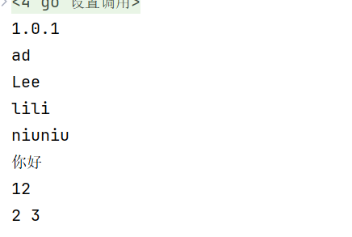
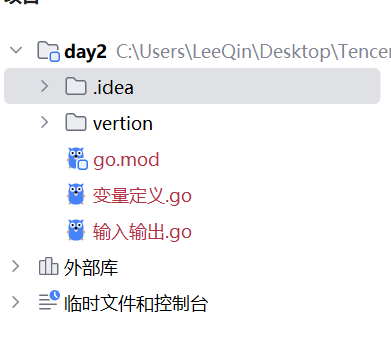
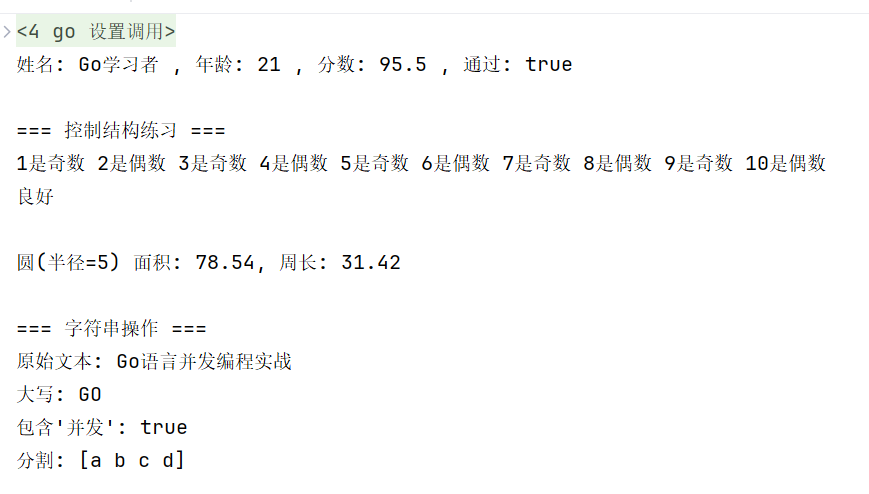

# Go语言的基础语法
    Go语言是一门灵活的语言，在它的身上我看到了很多java的影子，这也是我决定以Go为主以java为辅的原因之一。

## Go中的变量定义


    变量分为：**局部变量** 和 **全局变量** 
    **局部变量** 一经定义就必须要使用，不然就报错，局部变量有四种定义方法
    **全局变量** 定义在方法体外，类之内，整个类的方法都能用这个变量

```go
package main

// 调用一个输出包
// import "fmt"

// 当要调用的包比较多，我们可以这样

import (
    "fmt"
    // 当然不调用也可以，但这里我们先调用，同时一定要锁定根目录的文件,以下是示范，请你使用的时候换成自己的vertion包的路径地址
    "/xxx/xxx/vertion"
)

// 现在定义全局变量
// 即使没人调用也不会报红
var a = 12

// 全局变量中定义多个变量
var (
    s1 string = "在外面"
    s2 string = "不报错"
)

func hello(){
    // 在这个方法中无法调用main中变量
    fmt.Println("你好")

    // 但在这个方法中可以用a，因为a是全局变量
    fmt.Println(a)
}

func main(){
    // 这样就能调用另一个vertion包中的内容了
    fmt.Println(vertion.Vertion)
    // 但不能调用小写的vertion,这样会报错
    // fmt.Println(vertion)

    // 现在定义局部变量

    // 先声明
    var name string
    // 再赋值
    name = "ad"
    // 定义了不使用name就会标红
    fmt.Println(name)

    // 直接声明赋值
    var name1 string = "Lee"
    fmt.Println(name1)

    // 不用定义类型，也能自动识别
    var name2 = "lili"
    fmt.Println(name2)

    // 还有快速定义的方法，这也叫短声明
    name3 := "niuniu"
    fmt.Println(name3)

    // 调用方法
    hello()

    // 定义多个变量
    var a1,a2= 2,3
    fmt.Println(a1,a2)

}
```

让我们再定义一个包vertion，来试试什么样的方法可以被跨包调用，也就是public

```go
package vertion
// 这是一个常量const，定义以后就不会再改变
// 请注意命名规范，只有首字母大写的常量或变量才能被跨包调用
const Vertion string = "1.0.1"
const vertion string = "2.0.1"


```




## Go中的输入输出

    Go中的输入输出也有一定的讲究，并且充满趣味性

```go
package main

import "fmt"

func main() {

	// 首先是输出

	// 三种print，print非格式化输出不换行不空格；println自动换行；printf是格式化输出字符串
	// 不声明类型不能输出整数等类型，默认是字符串
	fmt.Print(1)
	fmt.Printf("1\n")
	fmt.Printf("%s是个超绝大美女", "灰灰大王")
	fmt.Println("我没有换行，我在美女后面")
	fmt.Print("我换行了，我在美女下面")

	// 格式化输出的一些常用符号
	// 可以作为任何值的占位符输出
	fmt.Printf("%v\n", "你好")
	// 打印类型T
	fmt.Printf("%v %T\n", "niu", "er")
	// 整数
	fmt.Printf("%d\n", 3)
	// 小数
	fmt.Printf("%.2f\n", 1.25)
	// 字符串
	fmt.Printf("%s\n", "length")
	// 用go的语法格式输出，很适合打印空字符串
	fmt.Printf("%#v\n", "")

	// 还有一个常用的将格式化后的内容赋值给一个变量
	name := fmt.Sprintf("%v", "你好")
	fmt.Println(name)

	// 输入

	fmt.Print("请输入你的名字:")
	var name1 string
	// &指针,指向这个定义的变量,我个人感觉变量存在方法里,应该是在栈中存储
	fmt.Scan(&name1)
	fmt.Println(name1)
	fmt.Print("请输入你的年龄:")
	var age int
	// 这里额外展示一次表示不限数据类型
	// fmt.Scan(&age)
	// 可以用另一个短定义的方式接住
	n, err := fmt.Scan(&age)
	fmt.Println(n, err, age)
}
```


## 数据类型以及输入输出练习

```go
package main

import (
	"fmt"
	"math"
	"strings"
)

//练习1： 变量和类型

func basicTypes() {
	var (
		name   string  = "Go学习者"
		age    int     = 21
		score  float64 = 95.5
		isPass bool    = true
	)

	fmt.Printf("姓名: %s , 年龄: %d , 分数: %.1f , 通过: %v\n ", name, age, score, isPass)
}

// 练习2：控制结构
func controlStructures() {
	fmt.Println("\n=== 控制结构练习 ===")

	// if-else，判断
	for i := 1; i <= 10; i++ {
		if i%2 == 0 {
			fmt.Printf("%d是偶数 ", i)
		} else {
			fmt.Printf("%d是奇数 ", i)
		}
	}

	fmt.Println()

	// switch，选择
	grade := 85
	switch {
	case grade >= 90:
		fmt.Println("优秀")
	case grade >= 80:
		fmt.Println("良好")
	case grade >= 70:
		fmt.Println("中等")
	default:
		fmt.Println("需要努力")
	}
}

// 练习3：函数
func calculateCircle(radius float64) (area, perimeter float64) {
	area = math.Pi * radius * radius
	perimeter = 2 * math.Pi * radius
	return
}

// 练习4：字符串处理
func stringOperations() {
	text := "Go语言并发编程实战"
	fmt.Println("\n=== 字符串操作 ===")
	fmt.Println("原始文本:", text)
	fmt.Println("大写:", strings.ToUpper("go"))
	//判断是否存在，存在则输出true
	fmt.Println("包含'并发':", strings.Contains(text, "并发"))
	//用数组分割字符串，并设立基准为‘，’，然后在每个分割字符中加入空格
	fmt.Println("分割:", strings.Split("a,b,c,d", ","))
}
func main() {
	//输出基本类型
	basicTypes()
	//控制转换
	controlStructures()

	// 函数调用
	//输入半径得面积和周长
	area, perimeter := calculateCircle(5.0)
	fmt.Printf("\n圆(半径=5) 面积: %.2f, 周长: %.2f\n", area, perimeter)

	//字符串处理
	stringOperations()
}
```



## 基本数据类型


### int类型

1. 默认的数字定义类型是int类型
2. 带个u就是无符号，只能存正整数
3. 后面的数字就是2进制的位数（uint8：8位无符号二进制）
4. uint8还有个别名是byte，一个字节=8个bit位
5. int类型的大小取决于所使用的平台，所以为了易用性，还是声明位数较好
6. 示例：
   - uint8
	>0 0 0 0 0 0 0 0 = 0
	>1 1 1 1 1 1 1 1 = 255 = 2^8-1
   - int8
	>0 0 0 0 0 0 0 0 = 0
	>0 1 1 1 1 1 1 1 = 127
	>1 0 0 0 0 0 0 1 = -1 (原码) 补码:(取反=反码+1)
	>1 0 0 0 0 0 0 0 = -128

### 小数类型

一个float32和float64，可以计算小数位

### 字符型

1. 掌握byte（单字节字符）和rune（多字节字符）即可，前者适用非汉语体系字符，后者适用汉语体系字符
2. 在Go中，字符的本质是一个整数，直接输出时，是该字符对应的UTF-8编码的码值
3. 可以直接给某个变量赋一个数字，然后按照格式化输出时%c，会输出该数字对应的unicode字符
4. 字符类型是可以进行运算的，因为它们相当于一个整数，都有各自对应的unicode码

### 字符串类型

和字符类型不一样的是，字符类型赋值用的是单引号，字符串用双引号

### 转义字符
记住常用的就好
1. \t：制表符（空格）
2. \n：回车
3. \"内容\"：添加双引号
4. \r：回到行首（前面输入的都清空）
5. \\内容\\：反斜杠（让内容两旁出现斜杠）

### 布尔类型

布尔类型只有真（true）假（false）两个值
1. 默认值为false
2. Go语言中不允许将整型类型转为布尔类型
3. 布尔类型无法参与数值运算，也无法与其他类型进行转换

### 零值问题

如果一个基本数据类型只声明不赋值，那么这个变量就是对应类型的零值
1. int：0
2. bool：false
3. string：""
4. float32：0
5. pointer：nil
   

## 结构体（struct）

	结构体定义需要用type和struct语句。struct语句定义一个新的数据类型，结构体中有一个或多个成员。type语句设定了结构体的名称。结构体的伪代码格式如下：

### 定义结构体

```go
	type struct_variable_type struct{
		member definition
		member definition
		...
		member definition
	}
```
	一旦定义了结构体类型，就能用于变量的声明，语法伪代码格式如下：

```go
	variable_name := structure_variable_type {value1, value2...valuen}
	或
	variable_name := structure_variable_type { key1: value1, key2: value2..., keyn: valuen}
```

### 访问结构体

	如果要访问结构体成员，需要使用点号.操作符，格式为：

``` 结构体.成员名```

### 结构体指针

```go
	package main

	import "fmt"

	type Books struct{
		title string
		author string
		subject string
		book_id int
	}

	func main(){
		// 声明book1是books类型
		var Book1 Books
	}
```


	定义指向结构体的指针类似于其他指针变量，格式如下：

``` var struct_pointer *Books```

	以上定义的指针变量可以存储结构体变量的地址。查看结构体变量地址，可以将&符号放置于结构体变量前：

``` struct_pointer = &Book1```

	使用结构体指针访问结构体成员，使用"."操作符：

``` struct_pointer.title```


## 切片（slice）

	Go语言切片是对数组的抽象，Go数组的长度不可改变，在某些场景这样的集合就不太适用，这里提供一个新的更为灵活的内置类型切片（“动态数组”），可以不断追加元素，在追加时会根据是否越界使切片的容量增大

### 定义切片

	你可以声明一个未指定大小的数组来定义切片：
``` var identifier []type```

	切片不需要说明长度或使用make（）函数来创建切片：

``` var slice1 []type = make([]type, len)```

	也可以写成：

``` slice1 := make([]type, len)```

	也可以通过capacity指定容量，这里的len是数组长度并且也是切片的初始长度：

``` make([]T, length, capacity)```