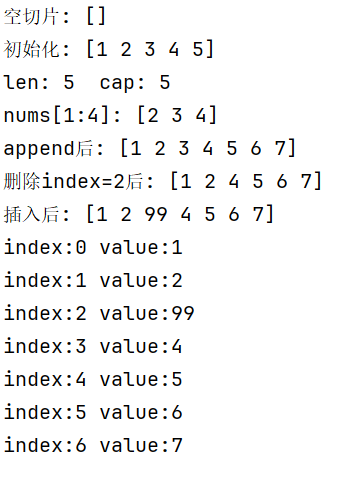
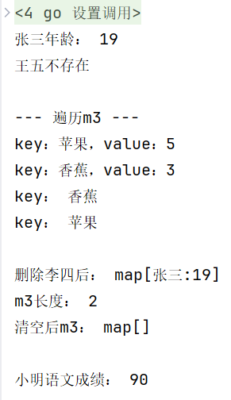
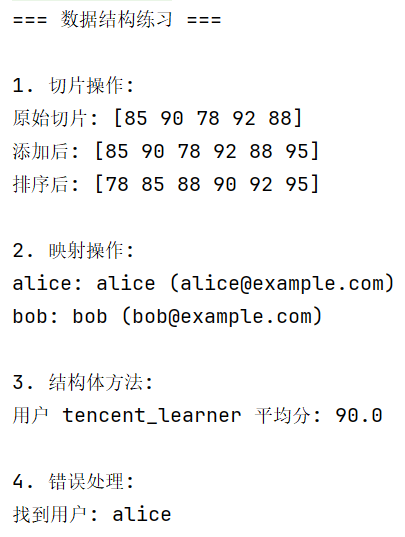

# 数据结构

## 结构体（struct）

	结构体定义需要用type和struct语句。struct语句定义一个新的数据类型，结构体中有一个或多个成员。type语句设定了结构体的名称。结构体的伪代码格式如下：

### 定义结构体

```go
	type struct_variable_type struct{
		member definition
		member definition
		...
		member definition
	}
```
	一旦定义了结构体类型，就能用于变量的声明，语法伪代码格式如下：

```go
	variable_name := structure_variable_type {value1, value2...valuen}
	或
	variable_name := structure_variable_type { key1: value1, key2: value2..., keyn: valuen}
```

### 访问结构体

	如果要访问结构体成员，需要使用点号.操作符，格式为：

``` 结构体.成员名```

### 结构体指针

```go
	package main

	import "fmt"

	type Books struct{
		title string
		author string
		subject string
		book_id int
	}

	func main(){
		// 声明book1是books类型
		var Book1 Books
	}
```


	定义指向结构体的指针类似于其他指针变量，格式如下：

``` var struct_pointer *Books```

	以上定义的指针变量可以存储结构体变量的地址。查看结构体变量地址，可以将&符号放置于结构体变量前：

``` struct_pointer = &Book1```

	使用结构体指针访问结构体成员，使用"."操作符：

``` struct_pointer.title```


## 切片（slice）

	Go语言切片是对数组的抽象，Go数组的长度不可改变，在某些场景这样的集合就不太适用，这里提供一个新的更为灵活的内置类型切片（“动态数组”），可以不断追加元素，在追加时会根据是否越界使切片的容量增大

### 定义切片

	你可以声明一个未指定大小的数组来定义切片，切片不需要说明长度：
``` var identifier []type```

#### make()函数

	使用make（）函数来创建切片：

``` var slice1 []type = make([]type, len)```

	也可以写成：

``` slice1 := make([]type, len)```

	也可以通过capacity指定容量，这里的len是数组长度并且也是切片的初始长度：

``` make([]T, len, capacity)```

### 初始化切片

    []表示是切片类型，{1，2，3，4，5}表示初始化值依次是1，2，3，4，5，其中cap=len=5

    将arr中从下表startIndex到endIndex-1下的元素创建为一个新的切片
``` nums := arr[startIndex:endIndex]```

### len()和cap()函数

    切片是可索引的，并且可以由 len() 方法获取长度。
    切片提供了计算容量的方法 cap() 可以测量切片最长可以达到多少。

### append()和copy()函数

    如果想增加切片的容量，我们必须创建一个新的更大的切片并把原分片的内容都拷贝过来。
1. 允许追加空切片
2. 允许同时添加一个到多个元素

### 切片的基础用法

```go
package main

import "fmt"

func main() {
	// 1. 定义切片var identifier []type
    // 空(nil)切片，一个切片未初始化之前默认为nil，长度为0
	var s []int
	fmt.Println("空切片:", s)

	// 2. 初始化切片
	nums := []int{1, 2, 3, 4, 5}
	fmt.Println("初始化:", nums)

	// 3. 长度和容量len()和cap()
	fmt.Println("len:", len(nums), " cap:", cap(nums))

	// 4. 切片截取 [起始:结束)
    // nums := arr[startIndex:endIndex]
	fmt.Println("nums[1:4]:", nums[1:4]) // [2 3 4]

	// 5. 追加元素
	nums = append(nums, 6, 7)
	fmt.Println("append后:", nums)

	// 6. 删除元素（index=2）
	nums = append(nums[:2], nums[3:]...)
	fmt.Println("删除index=2后:", nums)

	// 7. 插入元素（index=2 插入99）
	nums = append(nums[:2], append([]int{99}, nums[2:]...)...)
	fmt.Println("插入后:", nums)

	// 8. 遍历
	for i, v := range nums {
		fmt.Printf("index:%d value:%d\n", i, v)
	}
}
```
    运行结果：



## 映射(map)

- 关键特性：引用类型、无序、key唯一、必须初始化
- 核心操作：赋值、取值、遍历、删除、判存在

1. Map 是一种无序的键值对的集合。
2. Map **最重要** 的一点是通过 key 来快速检索数据，key 类似于索引，指向数据的值。
3. Map 是一种集合，所以我们可以像迭代数组和切片那样迭代它。不过，Map 是无序的，遍历 Map 时返回的键值对的顺序是不确定的。
4. 在获取 Map 的值时，如果键不存在，返回该类型的零值，例如 int 类型的零值是 0，string 类型的零值是 "" 。
5. Map 是引用类型，如果将一个 Map 传递给一个函数或赋值给另一个变量，它们都指向同一个底层数据结构，因此对 Map 的修改会影响到所有引用它的变量。
6. 必背：
    1. **map是引用类型** , 必须用 make 初始化才能赋值
    2. **Key 必须可比较** (不能是切片/函数/集合)， value任意类型
    3. 取值一定要用 value, ok := map[key] 判断 key 是否存在
    4. 遍历**无序**, 不要依赖遍历顺序
    5. 无内置清空函数，直接make新map即可
 
### 定义映射

    可以使用内建函数 make 或使用 map 关键字来定义 Map:

    keytype是键的类型，valuetype是值的类型。initialcapacity是可选的参数用于指定Map的初始容量，也就是map中可以保存的键值对的数量，当到达容量的时候，map会自动扩容。不指定的话，Go语言会根据实际情况自己选择一个合适的值。以下是一个make（）方法的示例：


``` map_variable := make(map[KeyType]ValueType, initialCapacity)```

    三个创建方法：

``` var m map[T]T、make(map[T]T)、map[T]T{}```

### 基础代码

```go
package main

import "fmt"

func main() {
	// 1. 【创建map】3种方式（最常用：make / 直接初始化）
	// 方式1：make创建空map（key string，value int）
	var m1 map[string]int
	m1 = make(map[string]int) // 必须初始化才能用，否则nil无法赋值

	// 方式2：简写（推荐）
	m2 := make(map[string]string)

	// 方式3：直接初始化（带初始值）
	m3 := map[string]int{
		"苹果": 5,
		"香蕉": 3,
	}

	// 2. 【赋值/修改】key不存在=新增，存在=修改
	m1["张三"] = 18
	m1["李四"] = 20
	m1["张三"] = 19 // 覆盖原有值

	m2["name"] = "Go学习"
	m2["version"] = "1.22"

	// 3. 【取值】两种方式
	// 方式1：直接取（key不存在，返回value类型零值）
	age := m1["张三"]
	fmt.Println("张三年龄：", age) // 19

	// 方式2：带判断（推荐，防止key不存在）
	value, ok := m1["王五"]
	if ok {
		fmt.Println("王五年龄：", value)
	} else {
		fmt.Println("王五不存在") // 输出这个
	}

	// 4. 【遍历】for range（无序！Go map不保证顺序）
	fmt.Println("\n--- 遍历m3 ---")
	for k, v := range m3 {
		fmt.Printf("key：%s，value：%d\n", k, v)
	}

	// 只遍历key
	for k := range m3 {
		fmt.Println("key：", k)
	}

	// 5. 【删除元素】delete(map, key)
	delete(m1, "李四")
	fmt.Println("\n删除李四后：", m1) // map[张三:19]

	// 6. 【长度】len(map) → 元素个数
	fmt.Println("m3长度：", len(m3)) // 2

	// 7. 【清空map】无直接清空方法，重新make即可
	m3 = make(map[string]int)
	fmt.Println("清空后m3：", m3) // map[]

	// 8. 【嵌套map】value是map（常用场景：复杂数据）
	student := make(map[string]map[string]int)
	student["小明"] = map[string]int{"语文": 90, "数学": 95}
	fmt.Println("\n小明语文成绩：", student["小明"]["语文"]) // 90
}
```
    运行结果：



### 数据结构代码
```go
// 1_Foundation/go_basics/day2_data_structures.go
package main

import (
	"fmt"
	"sort"
	"strings"
)

// 定义一个用户结构体
type User struct {
	ID       int
	Username string
	Email    string
	Scores   []int
}

// 结构体方法
func (u User) GetHighestScore() int {
	if len(u.Scores) == 0 {
		return 0
	}
	max := u.Scores[0]
	for _, score := range u.Scores {
		if score > max {
			max = score
		}
	}
	return max
}

// 补全：更新用户信息的方法
func (u *User) UpdateEmail(newEmail string) error {
	if !strings.Contains(newEmail, "@") {
		return fmt.Errorf("邮箱格式错误")
	}
	u.Email = newEmail
	return nil
}

func dataStructurePractice() {
	fmt.Println("=== 数据结构练习 ===")

	// 1. 切片
	fmt.Println("\n1. 切片操作:")
	scores := []int{85, 90, 78, 92, 88}
	fmt.Println("原始切片:", scores)

	// 添加元素
	scores = append(scores, 95)
	fmt.Println("添加后:", scores)

	// 排序
	sort.Ints(scores)
	fmt.Println("排序后:", scores)

	// 2. 映射
	fmt.Println("\n2. 映射操作:")
	userMap := map[string]User{
		"alice": {1, "alice", "alice@example.com", []int{85, 90}},
		"bob":   {2, "bob", "bob@example.com", []int{78, 92}},
	}

	// 遍历map
	for username, user := range userMap {
		fmt.Printf("%s: %s (%s)\n", username, user.Username, user.Email)
	}

	// 3. 结构体方法
	fmt.Println("\n3. 结构体方法:")
	user := User{
		ID:       1001,
		Username: "tencent_learner",
		Email:    "learn@tencent.com",
		Scores:   []int{90, 85, 95},
	}

	// 计算平均分
	avg := user.AverageScore()
	fmt.Printf("用户 %s 平均分: %.1f\n", user.Username, avg)

	// 4. 错误处理
	fmt.Println("\n4. 错误处理:")
	if user, err := FindUserByID(userMap, 1); err == nil {
		fmt.Println("找到用户:", user.Username)
	} else {
		fmt.Println("错误:", err)
	}
}

// 结构体方法
func (u User) AverageScore() float64 {
	if len(u.Scores) == 0 {
		return 0.0
	}

	total := 0
	for _, score := range u.Scores {
		total += score
	}
	return float64(total) / float64(len(u.Scores))
}

// 错误处理示例
func FindUserByID(users map[string]User, id int) (User, error) {
	for _, user := range users {
		if user.ID == id {
			return user, nil
		}
	}
	return User{}, fmt.Errorf("用户ID %d 不存在", id)
}

// 启动main方法
func main() {
	//调用数据结构体练习方法
	dataStructurePractice()
}
```
	运行结果：



