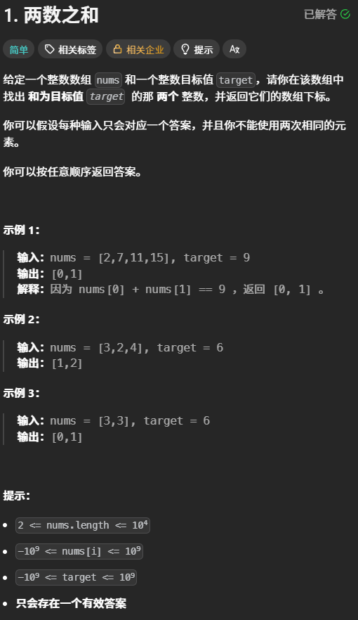
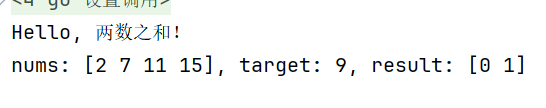
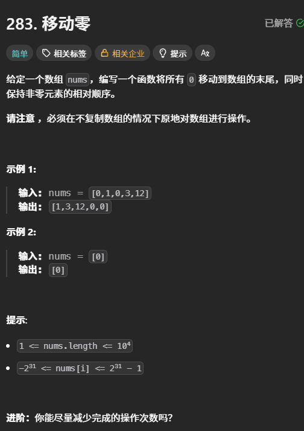
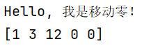
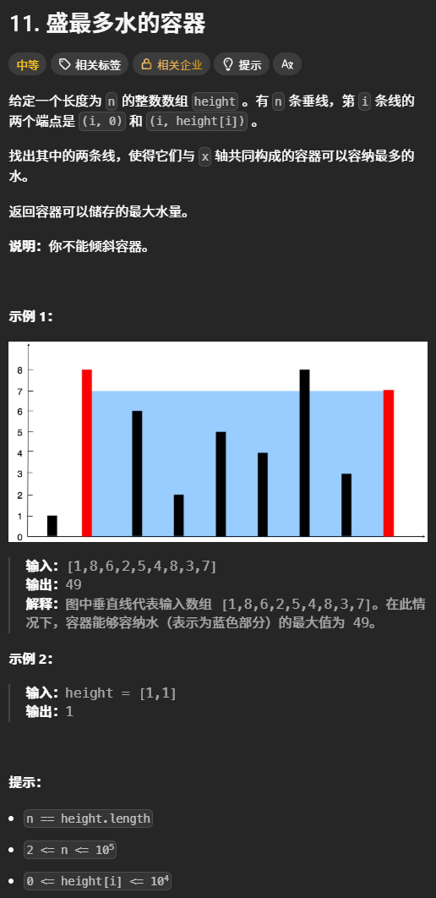
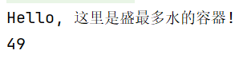

# 算法学习

## 数组

### 两数之和

#### 题目：


#### 代码实现：
```go

package main

import "fmt"

func main() {
	//	这是程序入口
	fmt.Println("Hello, 两数之和！")
	nums := []int{2, 7, 11, 15}
	target := 9
	result := twoSum(nums, target)
	fmt.Printf("nums: %v, target: %d, result: %v\n", nums, target, result)
}

// 两数之和函数
// 给予一个整数数组，一个目标数，通过两两相加，若是等于目标数，则返回两个下标
func twoSum(nums []int, target int) []int {
	// 暴力双循环 - 时间复杂度 O(n²)
	// 遍历每个数，看它后面有没有能和它加起来等于target的数
	/*
		for i := 0; i < len(nums); i++ {
			for j := i + 1; j < len(nums); j++ {
				if nums[i]+nums[j] == target {
					//	找到目标下标，返回
					return []int{i, j}//[0,1]
				}
			}
		}
	*/
	// 哈希表 - 时间复杂度0(n)
	// 创建一个map记录每个数需要的“另一半”的下标
	// 创建一个map，key：存值，value：存下标
	numMap := make(map[int]int)
	// 遍历nums数组中的数字,i是当前索引，num是当前值
	//for i:=0;i<len(nums);i++ 这是我的版本
	for i, num := range nums {
		//	找到另一半
		complement := target - num
		//	判断是否能在numMap中找到另一半
		//if idx, found := numMap(complement) found 这是我写的有错误的版本
		if idx, found := numMap[complement]; found {
			//	找到了
			//	idx是存储的“另一半”的下标，i是当前数的下标
			return []int{idx, i}
		}
		//	没找到，把当前数字存入numMap中，这里不会写
		// 这样以后别的数就能找到它
		numMap[num] = i
	}
	//返回一个空数组,没找到
	return []int{} //[]
}
```

#### 运行结果


#### 学习笔记：
**思路描述**：创建一个map记录每个数需要的“另一半”的下标，找到就直接返回
**问题描述**：期间有错误的输入和忘记思路的时候
1. 忘了需要通过make来初始化创建
2. 没有理解``` for i, num := range nums```这段代码
3. 没有理解``` if idx, found := numMap[complement]; found```这段代码
4. 遗忘``` numMap[num] = i```的作用
**解决方法\回答**：
1. 重复背记了map需要make初始化这段话
2. 解释如下：
  1. for i：设置一个数值从零开始for循环
  2. 从nums这个范围中range取出num，range是范围字符
3. 解释如下：我们可以拆分成两个部分 ``` idx, found := numMap[complement]``` 和 ``` if found```，这样我们就好理解了，idx和found就是判断complement是否在numMap中存在，然后取出它的索引，用idx索引。第二部分就是判断found（true/false）是否存在。我们需要记住的是这个判断语句的语法
4. 往numMap中存入num值的索引值i
**额外的**
- "=" 单纯的赋值  ":=" 声明并赋值，自动推断类型 


### 移动零

#### 题目：


#### 代码实现：
```go
package main

import "fmt"

func main() {

	fmt.Println("Hello, 我是移动零！")
	nums := []int{0, 1, 0, 3, 12}
	//nums1 := []int{}
	//nums1 = moveZeroes(nums)
	moveZeroes(nums)
	fmt.Println(nums)
}

func moveZeroes(nums []int) {
	// O(n^2)
	// 双指针方法，设定两个一左一右指针
	// 1.左指针指向**已经处理好的序列的尾部**，所以左指针的左边都是非零数
	// 2.右指针的左边到左指针都是0
	// 每次交换都是将左指针的零与右指针的非零数交换，且非零数的相对顺序没变
	left, right, n := 0, 0, len(nums)
	for right < n {
		if nums[right] != 0 {
			nums[left], nums[right] = nums[right], nums[left]
			left++
		}
		right++
	}
}
```

#### 运行结果：


#### 学习笔记：
**解题思路**：使用双指针，刚开始都指向0，右指针向右移动，当遇到非零数就与左指针的数交换
1. 左指针指向**所有处理好的数列**的尾部，因此左边全是顺序不变的非零数
2. 组后右指针的左边到左指针全为0
**问题描述**：一开始不会，用了错误的解题思路，依次读取然后往后放，不符合题目的要求（不创建新的数组）。照着题解学习后，测试的时候尝试出了问题，不会调用函数后的输出。
1. 额外创建了数组去接收返回值，不理解切片的运行原理
2. moveZerose函数声明没有返回值，但是以下（100-101）调用却接收了返回值
**解决方法\回答**：
1. Go的切片是引用传递，函数里修改会直接改原数组，不需要额外赋值，我直接调用后，输出原数组就好了
2. 注释掉，用以上方法

### 盛最多水的容器

#### 题目：


#### 代码实现：
错误代码：
```go
/*  
	1.else if 后面没写条件 → 编译报错
	2.right 初始值 = 0 → 宽度会出现 0，完全错了
 	3.用了两层 for 循环 → 时间复杂度 O (n²)，效率极低
	4.面积计算错误 → 高度应该取两个指针里更小的那个，不是大的
	5.这题不是快慢指针，是对撞双指针（左 = 0，右 = 末尾）
*/
func maxArea(height []int) int {
    // 设定一个双指针，快慢指针，左指针慢，右边指针快，每次积
    // 对比积的大小max，遍历后结束
    num, left, right, max, n := 0, 0, 0, 0, len(height)
    for left < n {
        for right < n {
            width := right - left
            if height[left] >= height[right] && width > 0{
                num = width * height[left]
            }
            else{
                num = width * height[right]
            }
            if num > max {
                max=num
            }
            right++
        }
        left++
    }
    return max
}
```

正确代码：
```go
package main

import "fmt"

func main() {

	fmt.Println("Hello, 这里是盛最多水的容器!")

	height := []int{1, 8, 6, 2, 5, 4, 8, 3, 7}
	maxArea := maxArea(height)
	fmt.Println(maxArea)
}

func maxArea(height []int) int {
	left, right, maxArea := 0, len(height)-1, 0
	//遍历指针，然后小的一侧往内缩
	for left < right {
		area := 0
		//得出宽
		width := right - left
		//	比对出最矮的一侧，作为高
		if height[left] < height[right] {
			area = width * height[left]
			left++
		} else {
			area = width * height[right]
			right--
		}
		//	判断面积是否最大
		if area > maxArea {
			maxArea = area
		}
	}
	return maxArea
}
```

#### 运行结果：



#### 学习笔记：
**解题思路**：使用对撞双指针，起始位置一个指向最左边，一个指向最右边。较小的一侧与宽相乘，最后较小的一侧向内缩，直到右指针小于左指针
**问题描述**：
1. right 初始值 = 0 → 宽度会出现 0，完全错了
2. 用了两层 for 循环 → 时间复杂度 O (n²)，效率极低
3. 面积计算错误 → 高度应该取两个指针里更小的那个，不是大的
4. 这题不是快慢指针，是对撞双指针（左 = 0，右 = 末尾）
**解决方法\回答**：
1. 要保证right大于left
2. 改成一层，就是对撞双指针，不需要right循环一遍再left循环一遍了
3. 改成先比较小的，然后与小的相乘了
4. 改成对撞双指针了


