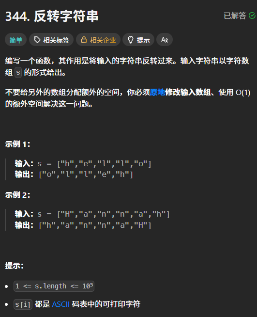
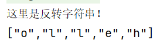
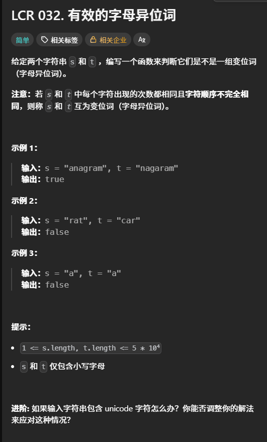
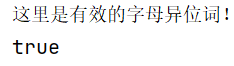
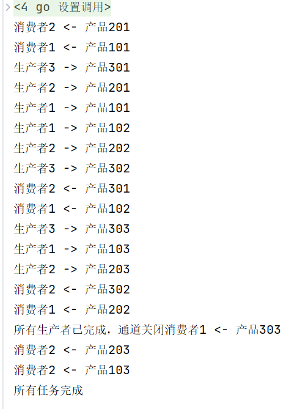

# 算法学习

## 字符串

### 反转字符串

#### 题目：


#### 代码实现：
```go 
package main

import "fmt"

func main() {

	fmt.Println("这里是反转字符串！")
	s := []byte{'h', 'e', 'l', 'l', 'o'}
	reverseString(s)
	//不能这么直接输出
	//fmt.Println(s) //[111 108 108 101 104]

	//	正确输出格式
	fmt.Print("[")
	for i, ch := range s {
        // 打印带引号的字符
		fmt.Printf("%q", string(ch))
		//	不是最后一个字符就加逗号
		if i < len(s)-1 {
			fmt.Print(",")
		}
	}
	fmt.Println("]")
}

func reverseString(s []byte) {
	//	设定两个指针，头尾交换
	left, right := 0, len(s)-1
	for left < right {
		s[left], s[right] = s[right], s[left]
		left++
		right--
	}
}
```

#### 运行结果：


#### 学习笔记：
**解题思路**：这题很简单，就是一个对撞双指针，交换首尾顺序就好了
**问题描述**：遇到了用例输出的格式问题
**解决方法/回答**：第24行到33行

### 有效的字母异位词

#### 题目：


#### 代码实现：
**错误实现**：这里用了一种很简单的方法，但是忽略了可能有重复的字符的可能性
```go
func isAnagram(s string, t string) bool {
	// 设定一个map，存储s，并且给每个字符添加一个顺序，然后依次遍历t中字符
	// 如果字符完全一样，并且顺序不完全相同，则返回true
	// 时间复杂度：o（n^2）
	flag := false
	// 词计数，确保不相同，一开始为0
	charCorrect, charNum := 0, 0
	// map存储s中的字符，并标记顺序
	charMap := make(map[int32]int)
	for i, chars := range s {
		charMap[chars] = i
		for j, chart := range t {
			if chart == chars {
				charCorrect++
				if i == j {
					charNum++
				}
			}
		}
	}
	if charNum != len(s) && charCorrect == len(s) {
		flag = true
	}
	return flag
}
```

**方法一：排序**：
```go
	//	方法1：排序 时间复杂度：o（nlogn)
	//	思路：用go语言中特有的排序方法来对比两个字符串
	//	首先，如果完全一样，直接返回false，不符合要求
	if s == t {
		return false
	}
	//	用sort方法来排序比较：
	//	先将两个字符串转换成字符数组
	s1, s2 := []byte(s), []byte(t)
	//	开始排序
	sort.Slice(s1, func(i, j int) bool { return s1[i] < s1[j] })
	sort.Slice(s2, func(i, j int) bool { return s2[i] < s2[j] })
	//	返回比较结果
	return string(s1) == string(s2)
```

**方法二：哈希表**：
```go 
//	方法2：哈希表 时间复杂度：o（n）
	//	思路：这里的关键就是：t是s的变位词等价于[两个字符串不同等且两个字符串中出现的字符的种类和频次相同]
	if s == t {
		return false
	}
	//	由于题目是只有26个小写字母，所以这里是[26]int作为种类范围
	var c1, c2 [26]int
	for _, ch := range s {
		c1[ch-'a']++
	}
	for _, ch := range t {
		c2[ch-'a']++
	}
	return c1 == c2
```


**题解三：unicode**：
```go
// len（s）就是s的字符长度，如果不一样就说明里面的字符不同
	// s和t相同就说明完全一样，也不用测了
	if len(s) != len(t) || s == t {
		return false
	}
	cnt := make(map[rune]int)

	for _, ch := range s {
		cnt[ch]++
	}
	for _, ch := range t {
		cnt[ch]--
		if cnt[ch] < 0 {
			return false
		}
	}

	return true
```

#### 运行结果：


#### 学习笔记：
**解题思路**：
1. 方法一：排序中用了go语言中的排序方法来对比两个字符串的内容是否相等
2. 方法二：哈希表中的关键在于**t是s的变位词等价于[两个字符串不同等且两个字符串中出现的字符的种类和频次相同]**
3. 这里是在方法二上的扩展，使其能应用于包含有unicode字符的场景，使用了rune
**问题描述**：这题我自己写，写错了。后来跟着学习了排序和哈希表的思路，以及如何运用rune。
1. 不理解``` sort.Slice(s1, func(i, j int) bool { return s1[i] < s1[j] })```这段代码
2. 不会使用哈希表方法以及unicode字符的场景
**解决方法/回答**：
1. 解析代码：
   1. sort.Slice(在这里面写排序的内容，以及排序的规则)
   2. s1, func(i, j int)：这一段就是对s1进行切片，然后根据i，j比较（i，j是临时位置，随机从s1中挑选两个字符来比较大小）
   3. bool {return s1[i] < s1[j]}：这段代码是判断正误，我希望这个切片以从小到大的顺序来排序，return后就是规则
2. 现在明白了是没抓住问题的核心关键，**不同等字符串** 、 **字符的种类和频次要相同**
3. 每种语法中的规则不尽相同，字符占的大小也不一样。这是一些底层的深度问题，需要多加去学习理解。

# 知识点掌握

## 生产者-消费者问题

### 初始代码：

```go 
package main

import (
	"fmt"
	"sync"
	"time"
)

func main() {
	//	创建带缓冲的通道（缓冲大小10）
	ch := make(chan int, 10)
	var wg sync.WaitGroup

	//	启动3个生产者
	for i := 1; i <= 3; i++ {
		wg.Add(1)
		go producer(i, ch, &wg)
	}

	//	启动2个消费者
	for i := 1; i <= 2; i++ {
		wg.Add(1)
		go consumer(i, ch, &wg)
	}

	//	等待所有生产者完成
	wg.Wait()
	//	关闭通道，通知消费者退出
	close(ch)

	//	给消费者一点时间处理剩余数据
	time.Sleep(500 * time.Millisecond)
	fmt.Println("所有任务完成")
}

func producer(id int, ch chan<- int, wg *sync.WaitGroup) {
	defer wg.Done()

	for i := 1; i <= 3; i++ {
		product := id*100 + i
		ch <- product
		fmt.Printf("生产者%d -> 产品%03d\n", id, product)
		time.Sleep(time.Millisecond * 200)
	}
}

func consumer(id int, ch <-chan int, wg *sync.WaitGroup) {
	defer wg.Done()

	for product := range ch {
		fmt.Printf("消费者%d <- 产品%03d\n", id, product)
		time.Sleep(time.Millisecond * 300)
	}
}
```

### 知识点解析：
1. 三个角色：
   1. 生产者：厨师，不断做菜
   2. 缓冲区：餐架，存放成品菜
   3. 消费者：食客，不断吃菜
2. 计算机定义：经典的并发编程模型
   1. 解耦：生产者和消费者不直接通信（中间有缓冲区）
   2. 异步：生产快，消费慢（或相反）互不阻塞
   3. 限流：缓冲区满，则生产者等待；缓冲区空，则消费者等待
3. OS知识：
   1. 临界资源与临界区
   - 临界资源：同一时间只能被一个线程访问的资源（如通道、缓冲区）
   - 临界区：访问临界资源的代码段（func consumer（）、func producer（））
   2. 同步与互斥
   - 互斥：同一时间只有一个GoRoutine 操作缓冲区
   - 同步：生产者生产 -> 消费者消费， 有序进行
   3. 底层实现原理
   - 互斥锁：保证缓冲区操作原子性（线程不能被再细分）
   - 条件变量：缓冲区满，生产者阻塞；缓冲区空，消费者阻塞
   - 环形队列：缓冲区底层数据结构
4. GO语言：
   1. GoRoutine（协程）：**一个func就是一个协程**
	  - 轻量级线程，栈KB级，操作系统线程MB级
	  - GoRoutine 调度，非操作系统内核调度
	  - go 函数名（）：启动一个协程
   2. Channel（通道）：**通道是Go并发的精髓，不要以共享内存通信，要以通信共享内存**
      1. 通道类型
         - 无缓冲通道：make(chan int); 发送和接受必须同时准备好，同步阻塞
         - 带缓冲通道：make(chan int, 10); 缓冲区满：发送阻塞，缓冲区空：接受阻塞（初始代码里用的就是这个）
      2. 通道方向（初始代码用到）：作用是**类型安全**，防止消费者误写、生产者误读
         - chan<- int：只写通道（生产者用）
         - <-chan int：只读通道（消费者用）    
      3. 通道关闭
         - close(ch)：关闭通道，不能再发送数据
      	 - for range ch：通道关闭且数据读完，自动退出循环``` for product := range ch```
   3. sync.WaitGroup：作用**等待一组协程执行完毕**
      - wg.Add(n)：计数器+n
      - wg.Done()：计数器-1
      - wg.Wait()：阻塞直到计数器=0 
5. 面试知识：
   1. 为什么要用生产者消费者模型？
		解耦、异步、削峰填谷、平衡生产消费速度差异
   2. Go如何实现生产者消费者？
		通道天然实现 **互斥** + **同步**，无需手动写锁。推荐：带缓冲通道 + WaitGroup
   3. 无缓冲vs带缓冲通道区别？
      1. 无缓冲：同步通信，必须收发同时就绪
      2. 带缓冲：异步通信，缓冲区满/空才阻塞
   4. 通道关闭注意事项？
      1. 只能关闭一次通道，多次关闭会panic（报错）
      2. 向已关闭通道发送数据，会panic
      3. 接收已关闭通道：返回零值， ok=false
   5. **什么情况会发生死锁？（初始代码的问题）**
      1. 所有GoRoutine阻塞， 没有可运行的GoRoutine
      2. 生产者消费者模型常见死锁：消费者等通道关闭，通道等消费者完成

### 初始代码问题：
1. 代码死锁，符合死锁四要素：**互相等待** -> **死锁**
2. 生产者全部完成 -> 调用wg.Done()
3. 消费者还在循环读通道 -> 不调用wg.Done()
4. main卡在wg.Wait() -> 永远执行不到close(ch)
5. 消费者永远等不到通道关闭 -> 永远阻塞

### 修复思路：
1. 生产者完成 -> 立即关闭通道
2. 消费者感知通道关闭 -> 自动退出
3. main只等待消费者完成

### 修复方案：
1. 两个WaitGroup：分别管理生产者、消费者
2. 单独GoRoutine：等待生产者完成 -> 关闭通道
3. main等待消费者 -> 优雅退出， 无死锁、无Sleep


### 修复后代码：

```go 
package main

import (
	"fmt"
	"sync" //同步原语：WaitGroup
	"time" //睡眠模拟业务耗时
)

func main() {
	//	创建带缓冲的通道（缓冲大小10）
	//作用：生产者生产十个以内的数据时不会发生阻塞
	ch := make(chan int, 10)
	//等待一组协程goroutine执行完毕
	//var wg sync.WaitGroup

	// 修改：等待生产者
	var producerWg sync.WaitGroup

	//	启动3个生产者协程
	for i := 1; i <= 3; i++ {
		//等待组计数器+1
		producerWg.Add(1)
		//启动生产者
		go producer(i, ch, &producerWg)
	}

	// 增加单独的协程：生产者完成 -> 关闭通道
	go func() {
		producerWg.Wait()
		close(ch)
		fmt.Printf("所有生产者已完成，通道关闭")
	}()

	// 修改：等待消费者
	var consumerWg sync.WaitGroup

	//	启动2个消费者协程
	for i := 1; i <= 2; i++ {
		//等待组计数器+1
		consumerWg.Add(1)
		//启动消费者
		go consumer(i, ch, &consumerWg)
	}

	//	阻塞：等待所有生产者+消费者 Done()
	//wg.Wait()
	//	关闭通道，通知消费者无数据准备退出
	//close(ch)

	//	睡眠等待消费者处理剩余数据（不优雅）
	//time.Sleep(500 * time.Millisecond)

	// 修改：等待所有消费者完成（优雅）
	consumerWg.Wait()
	fmt.Println("所有任务完成")
}

// 生产者：只写通道 chan<-
func producer(id int, ch chan<- int /*生产者通道*/, wg *sync.WaitGroup) {
	// 函数推出，计数器-1
	defer wg.Done()
	//每个生产者生产3个数据
	for i := 1; i <= 3; i++ {
		//生成产品编号
		product := id*100 + i
		//数据写入通道
		ch <- product
		fmt.Printf("生产者%d -> 产品%03d\n", id, product)
		//模拟生产耗时
		time.Sleep(time.Millisecond * 200)
	}
}

// 消费者：只读同道 <-chan
func consumer(id int, ch <-chan int /*消费者通道*/, wg *sync.WaitGroup) {
	// 函数退出，计数器-1
	defer wg.Done()
	// 遍历通道：通道未关闭且有数据就一直读
	// 通道关闭+数据读完：自动退出循环
	for product := range ch {
		fmt.Printf("消费者%d <- 产品%03d\n", id, product)
		//模拟消费耗时
		time.Sleep(time.Millisecond * 300)
	}
}
```

### 运行结果：


